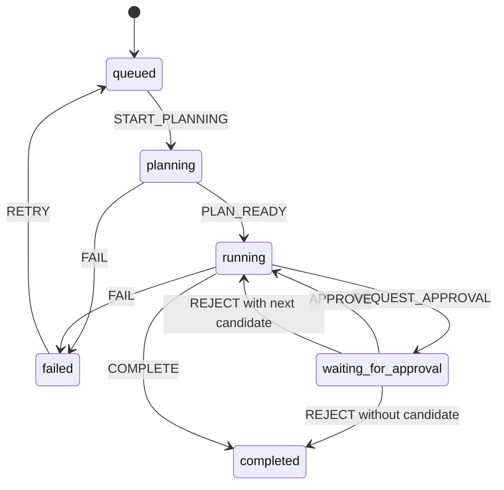

# State machine and recovery

The run state machine is explicit and validated after every transition.

## Transition table

| Current state          | Event              | Next state             | Required condition                                        |
| ---------------------- | ------------------ | ---------------------- | --------------------------------------------------------- |
| `queued`               | `START_PLANNING`   | `planning`             | New or retryable run                                      |
| `planning`             | `PLAN_READY`       | `running`              | Validated bounded plan exists                             |
| `planning`, `running`  | `FAIL`             | `failed`               | Typed run error is recorded                               |
| `running`              | `REQUEST_APPROVAL` | `waiting_for_approval` | Exactly one pending approval                              |
| `waiting_for_approval` | `APPROVE`          | `running`              | Matching pending approval                                 |
| `waiting_for_approval` | `REJECT`           | `running`              | Another ranked candidate exists                           |
| `waiting_for_approval` | `REJECT`           | `completed`            | No candidate remains; outcome is `no_experiment_approved` |
| `running`              | `COMPLETE`         | `completed`            | Approved experiment and action plan exist                 |
| `failed`               | `RETRY`            | `queued`               | Error is retryable                                        |

Invalid transitions fail closed. A waiting run must have exactly one pending
approval, a non-waiting run cannot retain one, and an action plan cannot exist
without a matching approved experiment.

## Checkpoints and retry

Every step has a status, attempt number, timestamps, and optional error. A
retry resets only the failed step to `pending`, increments its attempt, and
keeps completed steps and artifacts intact. The orchestrator then re-enters at
the first incomplete checkpoint. The `fail_once_at_scoring` mock scenario is a
deterministic acceptance fixture for this behavior.

## Approval idempotency

Approval decisions use a client-provided `decisionId` (or the
`Idempotency-Key` header):

- same decision ID and same decision: HTTP 200, `duplicate: true`;
- a different decision against an already-resolved approval: HTTP 409
  `APPROVAL_CONFLICT`;
- concurrent writers: MongoDB version compare-and-swap decides the winner and
  the loser reloads the authoritative run.

The paused run and approval are store data. Refreshing the browser does not
resume or skip the gate.
